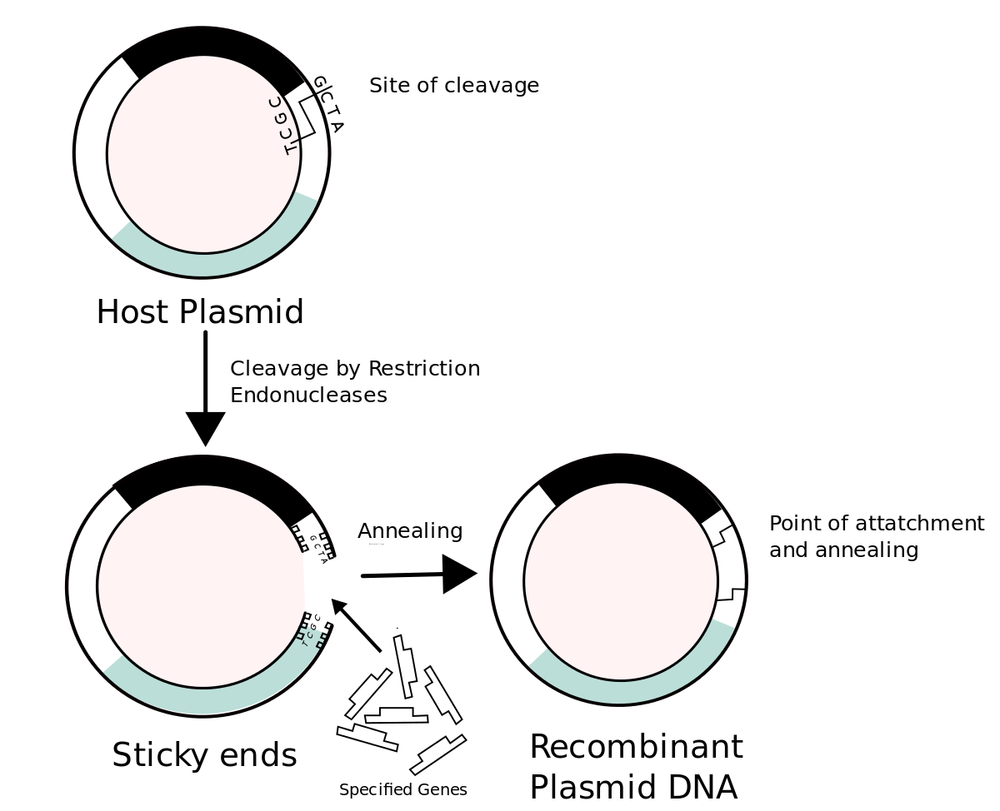

 # Recombiant DNA

Notes

* DNA combined from 2 organisms

 * Insulin is made in the pancreas

* Allows cells to absorb sugar from the blood

* Suger is used to make ATP (Enegy)
* Type 1 - Genetic
* Type 2 - Enviromental Lifestyle
